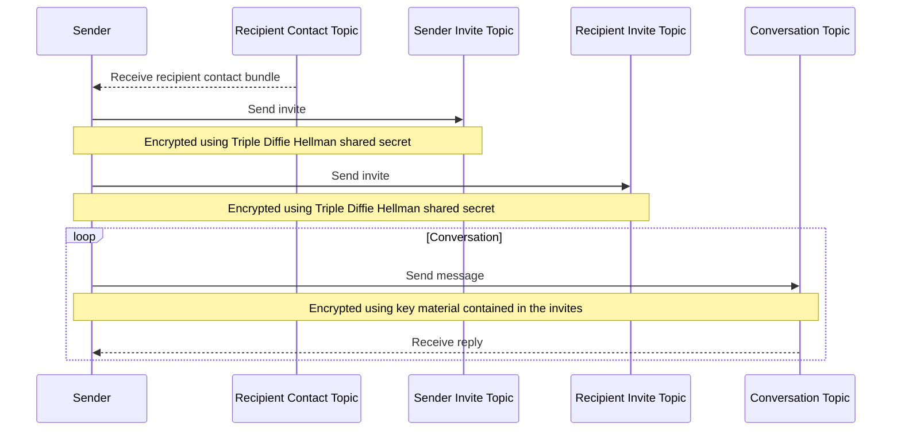

# XMTP Litepaper

**Version:** 1.0 Public Draft  
**Author:** Matt Galligan ([@galligan](https://github.com/galligan))  
**Contributors:** Pranay Anchuri ([@PranayAnchuri](https://github.com/pranayanchuri)), Saul Carlin ([@saulmc](https://github.com/saulmc)), Jennifer Hasegawa ([@jhaaaa](https://github.com/jhaaaa)), Martin Kobetic ([@mkobetic](https://github.com/mkobetic)), Nicholas Molnar ([@neekolas](https://github.com/neekolas)), Jazz Turner-Baggs ([@jazzz](https://github.com/jazzz))  
**Description:** The web3 messaging protocol, enabling secure communication between blockchain accounts.

---

_Note: This Public Draft is considered a work in progress. Please refer to the [GitHub Issues for this repository](https://github.com/xmtp/litepaper-draft/issues) for outstanding additions, or requesting changes to be made._

---

- [1. Abstract](#1-abstract)
- [2. Introduction](#2-introduction)
  - [2.1 Highlighted concepts](#21-highlighted-concepts)
  - [2.2 High-level overview](#22-high-level-overview)
  - [2.3 Naming conventions](#23-naming-conventions)
- [3. Motivation](#3-motivation)
  - [3.1 Why not adapt SMTP and IMAP or other existing communication protocols?](#31-why-not-adapt-smtp-and-imap-or-other-existing-communication-protocols)
  - [3.2 Limitations in communicating with blockchain accounts today](#32-limitations-in-communicating-with-blockchain-accounts-today)
- [4. Secure web3 messaging with blockchain accounts](#4-secure-web3-messaging-with-blockchain-accounts)
  - [4.1 Initiating a blockchain account for messaging](#41-initiating-a-blockchain-account-for-messaging)
  - [4.2 Sending messages with XMTP](#42-sending-messages-with-xmtp)
    - [4.2.1 Securing messages between participants](#421-securing-messages-between-participants)
    - [4.2.2 Sending messages using XMTP identity keys](#422-sending-messages-using-xmtp-identity-keys)
    - [4.2.2 Triple Diffie Hellman derived key](#422-triple-diffie-hellman-derived-key)
    - [4.2.3 Private invitation topic](#423-private-invitation-topic)
    - [4.2.4 Receiving messages](#424-receiving-messages)
    - [4.2.5 Message submission criteria](#425-message-submission-criteria)
  - [4.3 Sending secure messages to unattended addresses](#43-sending-secure-messages-to-unattended-addresses)
    - [4.3.1 Sender key escrow](#431-sender-key-escrow)
    - [4.3.2 Managed key escrow](#432-managed-key-escrow)
      - [Permission-based threshold secret sharing key escrow](#permission-based-threshold-secret-sharing-key-escrow)
    - [4.3.3 Notifying unattended addresses of messages](#433-notifying-unattended-addresses-of-messages)
  - [4.4 Blockchain account identifiers](#44-blockchain-account-identifiers)
- [5. Portable inbox](#5-portable-inbox)
  - [5.1 Inbox filtering](#51-inbox-filtering)
  - [5.2 Use case-specific inboxes](#52-use-case-specific-inboxes)
- [6. Client app development](#6-client-app-development)
  - [6.1 Limitless potential for client apps](#61-limitless-potential-for-client-apps)
- [7. Types of communications, message formats, and extensibility](#7-types-of-communications-message-formats-and-extensibility)
  - [7.1 Types of communication in XMTP](#71-types-of-communication-in-xmtp)
    - [7.1.1 Direct messages](#711-direct-messages)
    - [7.1.2 Notifications and alerts](#712-notifications-and-alerts)
    - [7.1.3 Shared communication](#713-shared-communication)
    - [7.1.4 Group chats](#714-group-chats)
  - [7.1.5 Background messages](#715-background-messages)
  - [7.2 MetaMessages](#72-metamessages)
  - [7.3 Extensible message format](#73-extensible-message-format)
    - [7.3.1 Content types](#731-content-types)
    - [7.3.2 Developing new content types](#732-developing-new-content-types)
    - [7.3.3 Content fallback](#733-content-fallback)
- [8. Message delivery & storage](#8-message-delivery--storage)
  - [8.1 Separation of storage concerns](#81-separation-of-storage-concerns)
    - [8.1.1 Pre-delivery state](#811-pre-delivery-state)
    - [8.1.2 Post-delivery state](#812-post-delivery-state)
  - [8.2 Storage location](#82-storage-location)
- [9. XMTP Improvement Proposals](#9-xmtp-improvement-proposals)
- [10. Anti-spam, abuse mitigation, and conditional deliverability](#10-anti-spam-abuse-mitigation-and-conditional-deliverability)
  - [10.1 Email's anti-spam techniques, and how they translate](#101-emails-anti-spam-techniques-and-how-they-translate)
    - [10.1.1 End-user anti-spam techniques](#1011-end-user-anti-spam-techniques)
    - [10.1.2 Automated anti-spam techniques](#1012-automated-anti-spam-techniques)
      - [A lack of end-to-end encryption](#a-lack-of-end-to-end-encryption)
    - [10.1.3 Service provider rate limiting](#1013-service-provider-rate-limiting)
    - [10.1.4 Lessons from today's anti-spam techniques](#1014-lessons-from-todays-anti-spam-techniques)
  - [10.2 Defining unsolicited communications](#102-defining-unsolicited-communications)
  - [10.3 Conditional deliverability](#103-conditional-deliverability)
    - [10.3.1 Criteria for message submission](#1031-criteria-for-message-submission)
      - [Attestations](#attestations)
      - [Opt-in connections](#opt-in-connections)
  - [10.4 Postage fees and staking to send](#104-postage-fees-and-staking-to-send)
- [11. XMTP network and architecture overview](#11-xmtp-network-and-architecture-overview)
- [12. Litepaper updates and future work](#12-litepaper-updates-and-future-work)
- [Footnotes](#footnotes)

---

## 1. Abstract

The Extensible Message Transport Protocol (XMTP) is a secure messaging protocol that enables [communication between blockchain accounts](#4-secure-web3-messaging-with-blockchain-accounts). XMTP is implemented within a progressively decentralized communication network (XMTP network) that exists alongside, though independent of, blockchain networks such as Ethereum, Solana, and others, to introduce the ability to securely communicate between their accounts.

Coined for the generational shift of the World Wide Web that its name represents, web3 encompasses technological concepts such as decentralization, blockchain technologies, and cryptocurrency-and-token-based economics. Within web3, participants utilize blockchain accounts that they own and control, represented by publicly available unique identifiers. These accounts enable participants to directly transact with one another, without the need for trusted intermediaries or reliance on centralized service providers to facilitate interactions.

While many new powers are given to web3 participants, one glaring limitation exists that is an otherwise ubiquitous feature of previous iterations of the web: the ability to easily and privately communicate between participants.

We believe this limitation hinders the widespread adoption and usability of web3 technologies, and see countless use cases where **secure messaging among blockchain accounts** could represent a major leap forward for the ecosystem. For example:

- Decentralized apps (dapps) need a way to engage and re-engage users. For example:
  - A social dapp can send notifications to users when they have new connections and messages.
  - A decentralized finance (DeFi) lending dapp can notify loan holders of impending liquidations of their positions.
- Projects need a way to keep their participants informed. For example:
  - An NFT project can send announcements to its owners
  - An NFT artist can send messages to collectors of their work about a new collection
  - A Decentralized Autonomous Organization (DAO) can alert token holders to upcoming important governance proposals
  - A protocol can alert its users about an upcoming airdrop, and how to claim their allocation
- Projects, Dapps, Companies, etc. need a way to securely provide direct support to users. For example:
  - An NFT marketplace can use a verifiable identifier, such as an [Ethereum Name Service (ENS)](https://docs.ens.domains/) name like `support.opensea.eth`, to securely communicate with its users.
- Web3 participants need a way to communicate with other participants. For example:
  - A participant can propose an offer and negotiate to acquire an NFT by directly messaging its owner's public address

The ability to communicate is core to the usability, accessibility, and ubiquity of today's World Wide Web. Because web3 lacks this fundamental capability, participants must resort to less secure methods of communication and coordination, sometimes leading to scams and phishing attacks resulting in loss and theft of valuable assets. Today's status quo presents a systemic risk to web3 participants, and to the broader ecosystem. It's therefore our deeply held belief that the introduction of these capabilities to web3 is essential to increasing adoption and growth of the ecosystem.

Enabling communication between web3 participants opens up opportunities to make apps and systems more secure, more usable, and more accessible. Equipped with messaging capabilities, a project can directly support and provide guidance to its participants (as well as receive it), which can help with ease of use, engagement, and credibility.

To communicate by way of XMTP, a user initiates their preferred blockchain account with the XMTP network, which comes at no cost. The user can then use any [client app](#6-client-app-development) built with XMTP to view, send, and receive messages. By default these messages are encrypted end-to-end ensuring that only message participants are able to read those messages. A user can access all of their messages sent and received on the XMTP network by way of their [portable inbox](#5-portable-inbox), which is available to any client app that supports XMTP.

To better manage unsolicited messages, mitigate abuse, and maintain XMTP's reliability and overall network capacity, we propose a scheme called [conditional deliverability](#103-conditional-deliverability). It is a set of solutions for managing message deliverability that accounts for how messages are submitted to the network, recipient preferences, and any associated cost (called a [postage fee](#104-postage-fees-and-staking-to-send)) messages may or may not incur. These factors are used in a proving scheme in which senders attest to their having met the specified conditions, and upon submission the proofs are validated by XMTP nodes. These conditions can be set by the network and by recipients, allowing for a spectrum of permissive and restrictive scenarios. For example:

- A sender has established an [opt-in connection](#opt-in-connections) with a recipient, permitting them to send messages without a restrictive rate limit, or incurring any fees
- A sender wants to send a message to a blockchain account they've never interacted with before and they don't qualify for any other permissive scenario, making the sending of that message conditional on the payment of a postage fee, or meeting certain [token staking requirements](#104-postage-fees-and-staking-to-send).

Conditional deliverability ensures that users remain in control of who they can receive messages from, with some default rules set by the network as a minimum requirement. These conditions include and are not limited to information available via public blockchains, such as the relationship between sender and recipient, assets or transaction history, or XMTP-specific factors such as adversarial behavior, or messaging volume.

## 2. Introduction

XMTP is a secure messaging protocol and decentralized communication network that provides a means for blockchain accounts to send and receive messages. XMTP provides a messaging service via a network of nodes operated by independent entities, to reduce reliance on singular providers, where:

- Participants can authenticate with blockchain accounts to send and receive messages that are encrypted by default through any compatible client app.
- A user's inbox is portable across client apps.
- Abuse is mitigated by ensuring senders have met required criteria.
- Nodes are incentivized to operate in the interest of maintaining a healthy network.

We designed XMTP to be a means of communication that is privacy-preserving, permissionless, decentralized, and resistant to abuse. We maintain that over time it must remain simple to use by people and straightforward for developers to build with.

**Note:** This litepaper represents a continuous work in progress, and is made available at <https://github.com/xmtp/litepaper>. We will strive to keep this paper current with XMTP's latest development progress. Given its ongoing and iterative development, at any time XMTP's implementation may differ from what is described in this paper. <!-- Note that this repo does not yet contain the file, nor is made public -->

XMTP's current open source repositories are made available at <https://github.com/xmtp>.

### 2.1 Highlighted concepts

Four novel aspects of XMTP are particularly noteworthy:

1. **XMTP protocols (simplified as XMTP):**  
   A set of protocols for [creating cryptographically verifiable identities](#41-initiating-a-blockchain-account-for-messaging) based on blockchain accounts, using those identities to [encrypt, submit](#422-sending-messages-using-xmtp-identity-keys), [retrieve, and decrypt messages](#424-receiving-messages), encoding messages with extensible [content formats](#73-extensible-message-format), and validating [conditional deliverability](#103-conditional-deliverability) of messages.
2. **XMTP network:**  
   A network of nodes that relay and [store messages](#8-message-delivery--storage) on behalf of people and [client apps](#6-client-app-development) in accordance with XMTP protocols. Node operation will be progressively decentralized—first including a benevolent set of operators (the first of which being XMTP Labs), and later decentralizing through permissionless, incentivized node operation.
3. **Portable inbox:**  
   Users own their messages, and can send, receive, and view them [in any client app](#5-portable-inbox) connected to the network.
4. **Conditional deliverability (future):**  
   To account for spam, abuse, and other unsolicited messages, submitting to the network can be [made conditional](#103-conditional-deliverability) on satisfying requirements set by the protocol, or recipients. These qualifications include [opt-in connections](#opt-in-connections), relationships identified through [on-chain data](#attestations), and [postage fees paid or staking requirements met](#104-postage-fees-and-staking-to-send).

### 2.2 High-level overview

<!-- TODO add more in-document links to this section -->

A brief overview of the high-level elements that go into the use of XMTP:

- **[Client apps](#6-client-app-development):**
  - Encode and decode message formats using a standard interface
  - Encrypt and decrypt encoded message content
  - Submit and retrieve encrypted messages to and from the XMTP network
  - Generate keys that are derived from and map to corresponding blockchain accounts, capable of encrypting and decrypting messages
  - Persist blockchain account-derived identities locally or on the XMTP network
  - Can be user-facing or headless implementations
- **[Messages](#4-secure-web3-messaging-with-blockchain-accounts):**
  - Can be sent to XMTP-initiated blockchain accounts, shared inboxes, and recipients that haven't yet used XMTP (also known as unattended addresses).
  - Are encrypted such that only the message participants (sender and recipients) can decrypt them.
  - Are sent within `topics`, which organize messages based on a specific set of participants.
  - Contain payloads, transported as a set of bytes, that can represent any format that a developer wants to support, such as plain text, JSON, or even non-text binary content.
  - Are encoded with a **content type** to ensure interoperability and consistency of experience without ambiguity across the XMTP network.
    - New content types can be created and used without going through a formal process.
    - The XMTP Improvement Proposal process can be used to socialize and adopt new formats as standards.
    - Can decode to simple "fallback" plaintext, ensuring client apps can display something if unable to render the original content.
  - Can be sent in the "background" or hidden from user view, in order to pass metadata to client apps.
- **XMTP SDKs:**
  - Enable client apps to interface with the XMTP network
    - Implement XMTP client protocols
      - For example, the SDK implements XMTP's end-to-end encryption protocol
    - Bundle standard content types
  - Are language-specific
    - For example, `xmtp-js`
- **Wallets:**
  - Create and provide signatures to client apps so they can generate secure blockchain account-based identities
  - Create and provide signatures to retrieve relevant data from the XMTP network
- **Nodes:**
  - Are physical or virtual machines that run software that implements XMTP protocols
  - Relay encrypted messages into replicated storage
  - Retrieve encrypted messages from storage and deliver them to client apps
  - Persist blockchain account-derived identities and advertise associated public keys

### 2.3 Naming conventions

The name XMTP stands for Extensible Message Transport Protocol and was inspired by its communication protocol forebears: Simple Mail Transfer Protocol (SMTP) and Extensible Message and Presence Protocol (XMPP).

- Use of "XMTP" is context-dependent, and refers to the:
  - Messaging protocol itself
  - Open source project
- "XMTP network" refers to a network of nodes that follow the rules of the XMTP protocol
- "XMTP Labs" refers to the company formed to establish and contribute to XMTP

## 3. Motivation

For decades, email has served well as a means of communication that's permissionless and decentralized. Broad adoption of SMTP as a mail transfer standard has meant that anyone can run their own email server, build their own email app, and send mail to any email address, without requiring authorization or permission from any authority.

While countless other forms of digital communication have emerged over time, email's ease of use, ubiquity, and open nature aided in its survival and hardiness and has made it a tremendous example of a decentralized (though federated) communication network.

However, email, along with the most popular messaging apps and platforms, push notifications, and other current forms of digital communication, are not natively compatible with web3. This incompatibility largely exists because blockchain networks are closed systems that can't natively communicate beyond their own ecosystem, and because the aforementioned platforms do not use blockchain accounts as identities.

### 3.1 Why not adapt SMTP and IMAP or other existing communication protocols?

While there's no specific limitation that would prevent those protocols from being adapted to use blockchain accounts as identities, the core issue we find is that they rely on specific servers or service providers to provide access. In the case of email, messages are transferred between mail servers controlled by specific entities. Associating an otherwise decentralized blockchain account with a centralized mail server to send and receive mail could pose a number of risks, such as censorship by the service provider, or denial of service attacks targeting the provider.

Furthermore, we believe that privacy preservation is important in the context of modern communication mediums, and protocols such as SMTP or XMPP lack the necessary components to protect users from surveillance by their service providers. In the context of SMTP, for example, relationships, and the frequency of communication between senders and recipients is highly observable by mail servers facilitating the exchanges, regardless of whether mail payloads are encrypted.

### 3.2 Limitations in communicating with blockchain accounts today

When developing apps, it's easy to take for granted that email acts as both a means of identification (the email address), and a means of communication. However, in web3, while people are able to use public blockchain accounts as a means of identity, there is no such native or reliable means of communication.

This inadequacy was made abundantly clear in a casual conversation between Robert Leshner, a co-founder of Compound Labs, builder of the DeFi lending protocol Compound, and Matt Galligan, a co-founder of XMTP Labs and co-author of this paper. In this conversation, Leshner shared his disdain that despite knowing the Ethereum address of every account interacting with the Compound protocol, the protocol is unable to reliably communicate with any of its participants—even in circumstances as dire as an impending liquidation of collateral on a loan position.

Hearing such a crucial and unfulfilled use case led to the discovery of many others, including:

- Connecting NFT creators with their collectors[^1]
- Contacting individuals who have unclaimed assets waiting for them[^2]
- Stopping impersonation of individuals and projects that lead to theft[^3]

To bring communication into this thriving new ecosystem, XMTP aims to carve out a new path—one inspired by the past while also purpose-built for the novel and unique qualities of web3.

Building upon the principles of email before it, the foundation of web3 communication must enable an ecosystem anchored in the following traits:

- **Universal:** It must be open to any participant, using any client app, which can send any type of message to any form of recipient, regardless of where or how they will read the message.
- **Accessible:** It needs to be easy to understand and use.
- **Durable:** It must remain free from the control of any one party—whether benevolent, malicious, or apathetic.

Adding to these principles, we consider the importance of encryption for safe and private communication:

- **Secure:** It must have strong encryption by default, where messages are only readable by its participants.
- **Privacy preserving:** It must reduce observability, such that participants in the network are unable to collect data on network use, individual use, or relationships between users.

As the web evolves, so too will the methods and means people use to communicate. Email and its communication protocol SMTP have served us dutifully since the beginning of the internet, and as we embark on this new journey that web3 has opened the door to, it's time to bring email's essence along. It's time to build XMTP.

<!-- TODO finish section on giving every blockchain account an inbox

### 3.3 Giving every blockchain account an inbox

Today's blockchain networks do not natively enable their accounts to natively send and receive encrypted communications. Providing the means for blockchain accounts to securely communicate with each other, therefore, must be a capability added after-the-fact. In augmenting blockchain accounts with messaging capability, different paths can be taken which can dramatically impact which accounts can receive messages.

-->

## 4. Secure web3 messaging with blockchain accounts

Within web3, public addresses are used to identify specific blockchain accounts or smart contracts. For example, an Ethereum account's public address looks like: `0xd8dA6BF26964aF9D7eEd9e03E53415D37aA96045`. Additionally, there are name services that use simpler human-readable strings, such as an [ENS](https://docs.ens.domains/) domain like `maaria.eth`, that points to the blockchain account that controls it.

As an identifier, these strings are analogous to email addresses, phone numbers, or usernames. However, while it's easy to communicate by way of each of the aforementioned identifiers, blockchain accounts do not afford the same capability.

XMTP addresses this limitation by making it possible for blockchain accounts to send and receive encrypted messages, which we will refer to as "secure web3 messaging."

### 4.1 Initiating a blockchain account for messaging

Upon initial use, a user creates a cryptographic signature with a wallet app to connect to an XMTP client app, proving control over their blockchain account. This action does not transfer or expose the user's private keys or secret phrase, nor does it incur a network fee of any kind.

_Note: While there is no explicit limitation to the blockchain networks that could be supported by XMTP, the [xmtp-js SDK](https://github.com/xmtp/xmtp-js) currently supports obtaining signatures from Ethereum (and EVM-compatible) accounts via [ethers.js](https://github.com/ethers-io/ethers.js)._

Once the signature is verified, a new key bundle is generated which contains the following keys:

- `IdentityPublicKey`
- `IdentityPrivateKey`
- `PreKeys`

Generating these keys is a necessary step in enabling secure web3 messaging as they are used to encrypt and authenticate messages. These newly generated keys act as a proxy for the user's blockchain account public and private keys within XMTP, without risking the security of those keys.

Beyond using these derived keys for encryption purposes, the separation of these keys from a blockchain account's private keys or seed phrase improves the user experience of XMTP, and puts distance between the means to secure assets and messages. For example:

- Actions within XMTP happen off-chain, or external to a blockchain, and many require cryptographic signatures for authentication
  - If these actions required interacting with a wallet for each signature, it would result in a poor user experience
- It would be possible to directly save and use a blockchain account's private key, or seed phrase, to perform actions on a user's behalf, but this method would be considered highly insecure, putting an owner's assets at risk, and should be avoided at all costs

By generating new keys as derived from a blockchain account, we have greater flexibility in the context of secure communication, and don't put an account's security and value at undue risk.

Wallet signatures used to derive keys from can be independently verified and considered an attestation that the `IdentityPrivateKey` and `IdentityPublicKey` are the user's true proxy keys, since only the user's blockchain account private key could have created the signature.

Once obtained, the XMTP client app publishes the user's `IdentityPublicKey` and `PreKeys` to the XMTP network in a `PublicKeyBundle`. The `PublicKeyBundle` contains all of the information needed for someone to contact the user.

The `IdentityPrivateKey` (and a copy of the other keys, for good measure) are encrypted and stored locally on the client device or on the XMTP network in a manner that **only client apps authorized by the user's signature can access these encrypted keys.** By design, XMTP nodes cannot independently access these encrypted keys.

### 4.2 Sending messages with XMTP

Sending a message between blockchain accounts with XMTP is designed to be extremely simple, for both developers of client apps, and their users.

From a user's perspective, they simply enter the public address of their intended recipient (or ENS domain, which the app may resolve), compose a message, and hit send. Messages are subsequently encrypted and added to a "topic", which is a collection of messages with a specific set of participants.

From a developer's perspective, their client app is instructed to create a new message with the intended recipient, and include the message payload. With the xmtp-js SDK that looks like this:

```js
const conversation = await xmtp.conversations.newConversation(
  '0xd8dA6BF26964aF9D7eEd9e03E53415D37aA96045'
)
await conversation.send('Hello world')
```

What makes this example so simple, yet powerful, is how the SDK has taken care of all of the complexity around end-to-end encryption. This ensures that messages sent with XMTP are encrypted by default, freeing developers from carrying the encryption burden.

#### 4.2.1 Securing messages between participants

Encrypted communication between accounts is established by way of a shared secret exchange, initiated by a sender to a recipient address, using components of [Signal's X3DH](https://www.signal.org/docs/specifications/x3dh/) key agreement protocol. Subsequent messages are sent to a topic secured by a key shared by its participants.

When messaging recipients, senders are only required to present the public address of the recipient's blockchain account. To send a message to a recipient who the sender has not previously communicated with, the following steps are taken:

1. The sender's client app retrieves the `IdentityPublicKey` for the corresponding blockchain account's public address.
2. The client app sends an invitation to both the sender and recipient's invitation topic. The invitation contains a randomly generated topic name, and [passed symmetric key material](#423-private-invitation-topic). The invitation is encrypted using a [Triple Diffie Hellman derived key](#422-triple-diffie-hellman-derived-key).
3. The client app sends the message to the generated topic in the invitation, using a key derived from the generated key material from step 2. The unencrypted message is signed using the sender's identity key, with the signature included inside the encrypted payload.




For subsequent messages, the following flow is used:

1. The client app retrieves the invitation from the sender's invitation topic.
2. The client app sends the message to the generated topic in the invitation, using a key derived from the generated key material from the invitation. The unencrypted message is signed using the sender's identity key, with the signature included inside the encrypted payload.

_Note: The process for encrypting communications will soon change to accommodate further use cases and improve security. The current implementation used in XMTP can be viewed in [its documentation](https://xmtp.org/docs/client-sdk/security)._

#### 4.2.2 Sending messages using XMTP identity keys

When sending messages to recipients, users are only required to present the public address of the recipient's blockchain account. For recipients who have previously used XMTP, the client app retrieves the corresponding `IdentityPublicKey` for the blockchain account's public address.

From here, client apps establish a shared secret key between the parties, who mutually and asynchronously authenticate each other based on XMTP identity public keys.

Messages sent between the parties are:

- Encrypted
  - No one else can read your messages other than the message participants
- Authenticatable
  - Messages can provide cryptographic proof that a participant is in control of the account they claim to be sending messages from
- Deniable
  - Invitations can be forged to appear as coming from any participant, but legitimate participants can verify the invitations they see are authentic and unmodified.

Allowing users to send messages only to recipients who have already used XMTP provides for the best security and usability. However, requiring an XMTP identity key for every intended recipient may result in interaction failure, as senders may be frustrated by an inability to message someone not yet on the XMTP network. To address this scenario, XMTP provides [an alternate path](#43-sending-secure-messages-to-unattended-addresses) to securely send encrypted messages to any blockchain account.

#### 4.2.2 Triple Diffie Hellman derived key

These messages are encrypted with a shared secret derived using components of [Signal's X3DH](https://www.signal.org/docs/specifications/x3dh/) key agreement protocol. The shared secret is derived using the public `PreKeys` of the recipient and the private `PreKeys` of the sender (and vice versa when the recipient needs to decrypt the message).

Messages of this type are used to pass symmetric keys to a recipient and negotiate the topic for future communication. This method of encryption is used for all messages in previous versions of the XMTP SDK, and may be used to decrypt messages sent before topic negotiation was introduced.

Messages encrypted with this type of key contain unencrypted headers indicating the public keys of both parties in the conversation. Invitation messages offer cryptographic deniability as only the participants can verify that the keys used to encrypt the message match the identities listed in the headers.

#### 4.2.3 Private invitation topic

Users in the XMTP network may receive invitations to communicate on their private invitation topic. These invitations contain a randomly generated topic for further communication and key material to derive a symmetric encryption key for all communication on that topic. The invitation messages themselves are encrypted with a [Triple Diffie Hellman derived key](#421-triple-diffie-hellman-derived-key).

Once the invitation has been sent, all future communication is sent using the topic specified in the invitation. Messages on the specified topic do not contain any unencrypted headers indicating who the sender or the recipient may be and are encrypted using the key material from the invite.

#### 4.2.4 Receiving messages

Client apps can retrieve the message history of an individual topic or stream incoming and outgoing messages in real-time for all topics the authenticated user is participating in. They can decode, decrypt, and authenticate messages seamlessly.

Successfully received messages (that make it through decoding and decryption) are cryptographically guaranteed to be authentic. More specifically, the user can trust the message was sent by the owner of the blockchain account described in `message.senderAddress`, and that it wasn't modified in transit. Because the sender of a message is unforgeable, this enables use cases such as user support, where authenticity of the messages is critically important.

Messages that are sent or received are available to any client app as part of a user's [portable inbox](#5-portable-inbox).

#### 4.2.5 Message submission criteria

In the interest of simplicity, details around message submission criteria, and how it affects the sending of messages, will be covered later in [the section on conditional deliverability](#103-conditional-deliverability).

### 4.3 Sending secure messages to unattended addresses

_Note: This capability is in active development._

A core goal of XMTP is to enable any blockchain account to send and receive encrypted messages to any other blockchain account, regardless of if the recipient even knows about XMTP yet. This presents some challenges, as encrypting messages for an intended recipient typically requires knowing their public key. XMTP uses a signature from a user's wallet app to create a new public-private keypair for a blockchain account, to enable messaging. Message recipients without this public key are considered **unattended addresses**.

_Note: While a public key can sometimes be identified from transactions sent from a blockchain account, using this key for the purposes of encrypting messages would require that they be decrypted with that account's private key, which introduces security implications that should be avoided._

Despite lacking public keys for unattended addresses in XMTP, the means necessary for senders to encrypt outgoing messages should still exist. This would ensure senders can securely message any blockchain account, regardless of their knowledge or use of XMTP. We call this **message escrow**, which leverages key escrow systems to encrypt messages for unattended addresses.

_Note: Multiple approaches for message escrow are in active development._

#### 4.3.1 Sender key escrow

In this system, when intending to message an unattended address, senders generate keys which they use to encrypt the message. The recipient's portion of the key is then held in escrow within the sender's account for later retrieval.

When the intended recipient signs into an XMTP client app and receives an `IdentityPublicKey`, an introduction topic is established where keys are exchanged between original sender and the recipient. The escrowed key is encrypted with a shared secret and is securely delivered to the intended recipient, enabling them to decrypt the original message.

The sender key escrow scheme:

- Is native to XMTP
- Does not require a trusted party outside of message participants to facilitate the key exchange
- Ensures all messages are secure and encrypted, regardless if the destination is an unattended address

While coordination with the sender is required for the intended recipient to retrieve their decryption key, the exchange is seamlessly facilitated by the XMTP SDK.

#### 4.3.2 Managed key escrow

Managed key escrow provides a means for senders to encrypt messages going to unattended addresses, where the recipient can retrieve and decrypt messages immediately after initiating with XMTP, and requiring no additional coordination by the sender. This system requires the presence of a third party or parties to facilitate the key exchange.

Client apps would be responsible for handling key exchanges on behalf of senders and recipients. Which method or methods client apps provide as key escrow options to users can depend on various factors such as end-user experience, security concerns, or services they wish to make available.

Requesting keys from managed providers should be made to be transparent to users making the request, and use XMTP as the transport layer, so as to promote maximum compatibility with receiving client apps.

<!-- TODO 
##### Managed key storage

-->

##### Permission-based threshold secret sharing key escrow

Another technique being explored for key escrow is that of generating new keys for the intended recipient and protecting them with a _permissioned_ threshold cryptosystem. In this cryptosystem, keys are turned into partial shares and distributed to different participants, where specific individual participants or combinations thereof are required for revealing the secret. This technique enables the sender to define retrieval requirements and provides them with a high degree of control around how a secret (the keys) is revealed, while not requiring the sender for further coordination.

_Note: We will publish our work on this system, which we call Permission-based Secret Sharing (PERMISS) at a later date._

#### 4.3.3 Notifying unattended addresses of messages

XMTP gives senders a better user experience in that it doesn't require them to know who has used it before, nor does it restrict sending messages to XMTP users exclusively. However, when a message is sent to an unattended address, a sender may still wish to inform its corresponding blockchain account to the existence of their encrypted message. This can happen in a number of ways, for example:

- Client apps can help senders create an on-chain transaction such as:
  - An NFT which can be sent to the blockchain account corresponding to the unattended address, which alerts them about the message and how to read it
  - A direct transfer of a nominal amount of ETH, so as to add a URL containing retrieval instructions via the `data` field within the transaction
- Senders can reach out directly to the owner of the unattended address in a public manner, such as Twitter, to alert them to the message
  - This may seem redundant, but it's worth noting that the message sent with XMTP is encrypted and sent directly to a blockchain account where subsequent responses can be verified as cryptographically authentic

In the future, it may be desirable for XMTP to handle this directly with an on-chain action, by way of deploying smart contracts that could be triggered by senders to interact with recipients directly on-chain.

### 4.4 Blockchain account identifiers

Within web3, various solutions exist that assign identities to, or derive identities from blockchain accounts. These identities are often made portable across different web3 experiences, and likewise could be used within XMTP. Some of these solutions associate memorable identifiers with public addresses for improved usability, or added functionality, such as:

- ENS domains, such as `galligan.eth`, often used as a username of sorts within web3
- Decentralized social network profiles, such as `galligan.lens` on [Lens Protocol](https://lens.xyz/), or a [Farcaster name](https://github.com/farcasterxyz/protocol#32-farcaster-name-registry-fnr) like `@mg`

<!-- TODO figure out the best way to get DIDs in here -->

As XMTP uses blockchain account public addresses of senders and recipients by default, use of these identifiers and naming services are currently considered an application-level abstraction.  Client apps can resolve identifiers to public addresses in the manner they wish. This means that app developers are free to choose which identity solutions to support in their client apps.

## 5. Portable inbox

Messaging is a common feature available in apps and websites today, but communication within those experiences is often reserved to only the users of each siloed app or website. Adding a messaging experience to an app typically means the user’s inbox is restricted to that app alone.

For example, some websites include a support chat widget that enables people to get user support directly from within the website. However, unless the user provides their email address as an alternate destination for messages, if they leave the website they can no longer receive any follow-up from support.

XMTP addresses this limitation by introducing the concept of a "portable inbox" in which client apps present a user’s message history in its entirety, including messages they sent and received using any client apps.

A portable inbox gives users ownership over their messages, and grants them the freedom to take their messages with them. In the above support chat widget example, if it were to use XMTP, and the user leaves the website, those follow-up messages would still be visible in any other client that supports XMTP, such as a chat app.

### 5.1 Inbox filtering

Client apps have the discretion to apply filtering to a user's message history and display a subset of their messages. Messages excluded from display are still available in other less restrictive client apps, as are messages sent from within that filtered environment.

For example, an NFT marketplace can embed a client app that enables messaging for its users. To keep the experience streamlined, the app can filter out messages sent to users by external parties. This filtering can be done based on publicly accessible information, such as specific blockchain accounts and network transaction metadata, but not on encrypted message content, for example.

### 5.2 Use case-specific inboxes

Client apps can elect to restrict display of messages to a specific [content type](#731-content-types). This can be desirable in certain use cases, such as a notifications feed. For example, while a user's portable inbox contains messages from all contexts and content types, for the purpose of displaying notifications only, the app can elect to display a `Notification` content type only.

## 6. Client app development

XMTP's protocols and network are open and permissionless. Client apps can freely implement XMTP's client protocols and permissionlessly interface with nodes participating in the XMTP network in order to provide messaging functionality to users. Development of client apps is made easier by way of XMTP SDKs that provide language-specific client protocol implementations and network interfaces.

### 6.1 Limitless potential for client apps

XMTP gives developers the freedom to build client apps that take on many different forms. The only requirement is that the app implement XMTP's client protocols and provide valid commands to XMTP nodes. Developers can elect to use the XMTP SDK, which simplifies these steps.

As XMTP is a generalized communication protocol with flexible message payloads, developers can build a diverse set of client apps, each with a unique interpretation and expression. For example:

- An email-like app, such as Gmail or Superhuman, focused on an inbox-like experience
- A chat app, similar to Telegram or Signal
- A direct message feature with a social app, similar to Twitter DMs
- A group chat app, similar to Discord or Slack
- A notification app, providing a feed of notifications, filtered by a specific content type
- A support widget integrated into a website, similar to Intercom or Zendesk
- A marketing platform, similar to Mailchimp or Campaign Monitor
- A workflow automation service, similar to Zapier or IFTTT, that can be used to send messages based on events
- An oracle monitoring a smart contract on a blockchain, which can be used to relay on-chain messages off-chain, based on events

## 7. Types of communications, message formats, and extensibility

Over the last few decades, many text-based methods of communication have emerged, such as email, SMS, instant messaging, app-based chat, and push notifications. Each method has its own rules, format, protocol, network, and more. As blockchain networks lack the ability to directly use these methods, it would be meaningful for XMTP to support the development of similar methods by providing a web3-compatible open protocol, network, and set of standards.

XMTP does not require a specific format for messages and messages are encrypted by default. At the network-level, a message's payload is represented by ciphertext, which contains an encoded and encrypted raw byte sequence of the original message. By default, messages contain plain text strings, and more expressive content types can be created and supported.

Client apps are ultimately responsible for properly rendering message content once decrypted and decoded. Therefore, in the interest of usability, apps implementing XMTP should support formatting standards that have been adopted through [improvement proposals](#9-xmtp-improvement-proposals).

<!-- TODO Update the paragraph above based on new additions -->

### 7.1 Types of communication in XMTP

Enabling blockchain accounts to send and receive secure messages unlocks a lot of potential for many different use cases and types of interactions. The core purpose of XMTP is to reliably deliver secure messages, and as a transport protocol it is intended to be relatively unopinionated about message payloads and purpose. A few communication archetypes can be supported by XMTP:

#### 7.1.1 Direct messages

This is the simplest of interactions in XMTP—communication between a sender and a recipient. In the context of XMTP, even the most basic direct message use case has an added benefit of enabling participants to cryptographically verify the authenticity of messages they receive.

_Note: Direct messages are available to use in XMTP today, with other communication types actively in development and coming soon…_

#### 7.1.2 Notifications and alerts

Notifications are messages that carry a purpose, and are most likely to be sent by a dapp, project, or other entity. Encrypted by default, they can contain even the most sensitive of information as only the intended recipient can read them. With XMTP's extensible [content type](#731-content-types) message format, client apps can be set up to distinguish notifications and alerts from other types of messages.

#### 7.1.3 Shared communication

DAOs, teams, and other organizations are able to send and receive encrypted DMs, announcements, and more using a shared identity that can resolve to a chosen [blockchain account identifier](#44-blockchain-account-identifiers) such as `team.xmtp.eth`.

Shared account admins will be able to delegate to and revoke access from individual user accounts.

#### 7.1.4 Group chats

A group of users in XMTP will be able to come together and participate in encrypted chats, where participants can verify the authenticity of messages and senders, without concern of leaking information to uninvited third parties.

### 7.1.5 Background messages

Background messages can coordinate application-level functionality, to be interpreted exclusively by client apps, and are not presented to users. They are sent the same way as any other message, and carry instructions that client apps can interpret to execute commands, share client app state, act as a store for user settings, and more. Examples of these types of messages include:

- A list of "contacts" where blockchain accounts have been given aliases by a user
- A set of preferences that can define the user experience an XMTP client should respect, such as a particular setting for dark mode
- A preference for which client app(s) and device(s) should notify the recipient upon receiving messages
- A list of "pinned" topics that are prioritized in a message list

Each of the above example use cases can exist in their own `topic`, where client apps interpret the messages, and can choose to take action based on the messages they contain. This type of structure allows for client app developers to extend functionality, and share state, to other client apps, while still using XMTP as the transport layer, and maintaining a user's ownership of the data.

### 7.2 MetaMessages

MetaMessages are special automated messages that provide support for XMTP protocol-level functionality, and must be supported by all client apps as they facilitate critical operations. Their use is built into the SDK and provide the necessary instructions to handle key transfers, introductions, message deletions, and other protocol-level concerns.

### 7.3 Extensible message format

XMTP is a largely unopinionated and generalized messaging protocol that enables developers to build for many diverse use cases. Therefore, ensuring flexibility in what messages contain and how client apps render messages is important. Traditional email presents a similar challenge, where clients are left to interpret and render mail sent from any potential source. The [Multipurpose Internet Mail Extensions (MIME)](https://en.wikipedia.org/wiki/MIME) internet standard addressed this by extending the format of email messages to support text in character sets other than ASCII, as well as attachments of audio, video, images, and apps.

#### 7.3.1 Content types

We address these challenges by introducing a framework for interoperable support of different types of content contained in messages—simply called "**content types**." At the heart of the framework are provisions for attaching meta-information to the content that identifies its type and structure. The meta-information also allows for the correct decoding of content from the encoded form used to transport it inside XMTP messages.

The content type framework was introduced as an [improvement proposal](#9-xmtp-improvement-proposals) to XMTP and can be seen in more detail in the [XIP-5 design document](https://github.com/xmtp/XIPs/blob/main/XIPs/xip-5-message-content-types.md).

Content type identifiers are scoped to allow different entities to define their own. The framework provides an interface for registering content type codecs with the client app for transparent encoding and decoding of content. For example, here is the most basic message format used in XMTP to establish broad compatibility among client apps, which is the default content type:

```ts
export const ContentTypeText = {
  authorityId: 'xmtp.org',
  typeId: 'text',
  versionMajor: 1,
  versionMinor: 0,
}

export class TextCodec implements ContentCodec<string> {
  get contentType(): string {
    return ContentTypeText
  }

  ...
}
```

#### 7.3.2 Developing new content types

As the XMTP protocol is unopinionated when it comes to the contents of message payloads, developers are free to explore other structures which may better suit their needs.

New message formats can enable client apps to extend the core functionality provided by XMTP. For example, a developer can include structured data within an encrypted message for more expressive payloads, enabling things such as:

- Replies, reactions, or message threading
- Images and other rich media
- Buttons and other UI components
- Methods of taking action, such as voting on proposals, or executing smart contracts

_Note: Rich media content would not be directly stored within XMTP. Instead a message could reference an externally stored resource._

Individual developers can create and support custom message formats in their own client apps. As XMTP is permissionless and a user's messages can be accessed from any other client app, considerations for compatibility across apps should be made.

A couple of paths are available to developers interested in using content types to extend the functionality of XMTP client apps while preserving compatibility:

- Utilizing a [content fallback](#733-content-fallback), where a message deemed incompatible with a client app is given plain text as a stand-in for the custom content
- Submitting content types as an [XMTP Improvement Proposal](#9-xmtp-improvement-proposals), which provides a path for broad adoption among other client apps

#### 7.3.3 Content fallback

As client apps receive messages and attempt to decode them, some messages in a user's inbox can contain a content type that's incompatible with that app. In the event of a message incompatibility, an error will be thrown. So that the app may still display some type of content to the user, a plain text fallback method is available to content type developers, similar to "alt" text for images in HTML.

Content fallbacks should represent the intent of the special format, and its content, written in plain text. To reliably distinguish the actual message content from the fallback,  the `ContentTypeFallback` content type identifier should be used.

## 8. Message delivery & storage

The core job of XMTP is to reliably deliver secure messages between participants, for subsequent presentation. Message delivery can be further broken out into the different needs that must be met:

- _How_ a message is stored
- _Where_ a message is stored

Each of these carries different requirements, and both have impact on client apps, the XMTP network, and user experience in general.

We will first focus on _how_ messages are delivered and stored by laying out the distinct states that messages exist in with XMTP: pre and post-delivery.

### 8.1 Separation of storage concerns

Messages in the pre- and post-delivery states have different characteristics and associated user needs, and relate differently to various encryption and network constraints:

- Messages in a pre-delivery state are encrypted with key material from two or more participants, and are stored in the XMTP network
- Messages in a post-delivery state can be stored with a logical grouping for a single owning entity, and stored according to a recipient's preference

When messages are in the pre-delivery state, they are stored within the XMTP network. This is to ensure that all participants of a given message are able to retrieve and decrypt it.

Once messages are in the post-delivery state, their existence in a shared storage environment is no longer necessary, and they can be offloaded to other locations better suited for persistence.

#### 8.1.1 Pre-delivery state

In the pre-delivery state, messages must be accessible and remain able to be decrypted by all participants, which necessitates storing them in a shared environment. This is where the XMTP network plays a critical role—it is where pre-delivery messages are stored.

Nodes in the XMTP network are responsible for, and incentivized to, store pre-delivery messages. This means that XMTP nodes are focused on providing storage for messages that are still considered "in-flight" and less-so with other scenarios.

With decentralization as a core concern for XMTP, it's critical to ensure that a network of independent node operators can collectively handle the storage needs of a communication network. By focusing the role of the XMTP network on storing messages in transit, the long-term burden on the network, and therefore the requirements for node operation can be reduced. Availability and latency become the top concerns, where volume becomes less of a focus.

Decreasing the system requirements to run a node can directly benefit the network's efforts towards decentralization, performance, security, reliability, and general capability in the following ways:

- Node operation costs are reduced
- A wider variety of devices and cloud instances are able to become nodes
- More nodes would be available to perform the duties of the network, which leads to greater reliability and resilience against malicious nodes
- A greater diversity of geographic placement of nodes is possible

#### 8.1.2 Post-delivery state

_Note: Post-delivery storage is on the roadmap, but not currently available as a feature. Currently all messages in XMTP are stored in the pre-delivery state.__

Once a message has been retrieved from the XMTP network, client apps can transition messages into a post-delivery state. In this state they:

- No longer need to be encrypted with shared key material
- No longer need to be retrieved by other participants

These simple factors open many opportunities for owners of these messages to exert greater control over how and where they are stored, and how they are secured, as facilitated by client apps.

First, post-delivery messages can be organized in a way that's centered around their owner. For context, messages in a pre-delivery state require retrieval from disparate locations, with operations to aggregate and order them, as well as decrypt each with their unique keys. By contrast, post-delivery messages can be aggregated and uniformly encrypted, such that retrieval and presentation is far simpler.


### 8.2 Storage location

The storage location for post-delivery messages can be the choice of their owner. Though storage options are vast, some consideration should be made around how XMTP client apps retrieve the post-delivery message store—especially in the context of preserving functionality of the owner's [portable inbox](#5-portable-inbox). This is an area where the XMTP SDK can add functionality to help—by facilitating seamless retrieval and display in a way that's largely indistinguishable from retrieval of pre-delivery messages from the XMTP network.

<!-- TODO come back to this

### 8.2 Storage motivations

Users of modern messaging solutions are accustomed to seemingly unlimited availability of message storage. This expectation is reinforced by things like Gmail's archive, messaging app histories that are never deleted, and Discord and Slack channels that are forever searchable.

While users may perceive their endless storage to be free, the costs of maintaining message history are often obfuscated, such as in the case of Gmail's advertising-based model.

However, given the status quo, we expect users to assume that their messages will be accessible forever within the XMTP network. Fulfilling this user expectation presents a challenge for a decentralized communication network given these realities:

- It's unlikely that any individual XMTP network node can store every message, for all accounts, forever
  - This would also concentrate dependency and power to a highly centralized point
- There is an infinite volume of messages that users could send and retrieve, and storing all of them would be an unrealistic expectation
- Storing a large volume of messages will require distributing them across some, but not all nodes, with duplicates of a message stored on multiple nodes to ensure availability
  - It would be likely that an individual account's available message history may be distributed across many, disparate nodes
    - Requiring that all XMTP nodes be queried for an account's entire message history will not be performant nor feasible
- Users might prefer to keep their messages in a personal data store of their choosing

To account for these challenges, XMTP separates the concerns of storing messages into two states: pre- and post-delivery. At current state, the XMTP network is storing all messages, but in the future will primarily be responsible for storing those in the pre-delivery state. XMTP nodes will have various incentives to relay and store pre-delivery messages. -->

## 9. XMTP Improvement Proposals

The goal of XMTP Improvement Proposals (XIPs) is to discuss standardized protocols for XMTP and its client apps, and to document them in a high-quality and implementable fashion. They specify implementation details, help establish consensus among the community, and provide structure for the continued development of XMTP.

Specifically, XIPs are design documents that:

- Detail new features for XMTP
- Detail process or environment changes for XMTP
- Provide information to the XMTP community

There are three major categories of XIPs, as well as more specific subcategories:

- A **Standards XIP** describes any changes affecting most or all XMTP implementations, or the interoperability of apps using XMTP.
  - **Core**: Includes proposals for rules and behavior around message relay by nodes, node incentive strategies, and backward-incompatible changes
  - **Network**: Includes networking specifications and proposals around how nodes communicate and interoperate
  - **Interface**: Includes client API/RPC specifications and improvements to how client apps interact with the network
  - **Storage**: Includes specifications and proposals for the storage of messages by or on behalf of client apps
  - **XRC** (_XMTP Request for Comment_): Includes application-level standards and conventions, including message content formats
- A **Process XIP** describes a process surrounding XMTP, or proposes changes to an existing process. They may propose an implementation, but not to XMTP's codebase; they often require community consensus; unlike Informational XIPs, they are more than recommendations, and users are typically not free to ignore them.
- An **Informational XIP** provides general guidelines or information to the XMTP community, but does not propose a new feature. Informational XIPs do not necessarily represent an XMTP community consensus or recommendation, so users and implementors are free to ignore Informational XMTP or follow their advice.

More information on XIPs and the process by which they are worked on can be found on GitHub in [XIP-0](https://github.com/xmtp/XIPs/blob/main/XIPs/xip-0-purpose-process.md).

## 10. Anti-spam, abuse mitigation, and conditional deliverability

According to Kaspersky Lab's [Spam and phishing in 2021](https://securelist.com/spam-and-phishing-in-2021/105713/), 45.56% of email sent in 2021 was spam. We see unwanted and unsolicited messages in our email, SMS, Discord servers, and countless other places. The lack of consequence and cost in sending spam has contributed to its proliferation and persistence. Even Bitcoin’s proof-of-work (PoW) consensus mechanism can be traced back to Hashcash[^4], a PoW-based system aimed at reducing email spam.

By XMTP enabling blockchain accounts to send and receive messages, it also opens them up to the same spam and abuse we've seen on the web before—with some added complexities and challenges. However, restricting message sending to opt-in scenarios exclusively could severely limit the opportunities for communication in the web3 ecosystem.

In consideration of this, we propose a set of solutions to manage message deliverability. These systems are intended to allow XMTP and its ecosystem to remain open, while granting individual users, client apps, and more broadly the network, a means to handle unsolicited communications, large volumes of messages, and adversarial network conditions.

### 10.1 Email's anti-spam techniques, and how they translate

Public blockchain networks differ from mediums like email and SMS in that all participant accounts, their historical activity, and current holdings are publicly visible. It is reasonable to assume that the information gleaned from blockchains could be used to effortlessly target accounts with unwanted messages, based on their public history.

#### 10.1.1 End-user anti-spam techniques

Blockchain accounts are vulnerable to spam by their public nature, and some of the simple end-user techniques afforded with email aren't as easily realizable.

For instance, having the discretion to not share a particular email address beyond a limited audience is possible with email. But given that public addresses for blockchain accounts are knowable by default, this presents a challenge. Messages can be sent to any address on-chain, encoded as transaction data or as an NFT, with no possibility of discretion for sharing by the account owner.

For messages sent off-chain, or not as a transaction within a particular blockchain, there are some additional options for discretion, but each has trade-offs.

For a sender to encrypt a message that a recipient can successfully decrypt, the right ingredients must be present for encryption to be possible. For example, given a public address for a blockchain account, XMTP [makes available](#422-sending-messages-using-xmtp-identity-keys) a corresponding public key known as an `IdentityPublicKey` for the purposes of sending encrypted messages to that account.

An alternative approach would be to give the account owner discretion over sharing their messaging public key. While this would afford the account owner some initial control in receiving messages, it is not without trade-offs:

- The account's messaging public key could easily be revealed by any party that knows it, whether intentionally, or accidentally, such as a secret email address being CC'ed instead of BCC'ed.
- The account would not be messagable by anyone without knowledge of the key, for any reason, including in the case of emergencies where perhaps an account is at risk of losing some of all of its assets.

By default XMTP makes a registered blockchain account's message public key available as we believe there is more value to it being public and will focus efforts around more effective anti-spam techniques.

#### 10.1.2 Automated anti-spam techniques

Many apps, services, and automated techniques are available to email service providers and mail server administrators today, with similar solutions found in other communication mediums. However, the most widely used solutions are possible because of a handful of characteristics, which are not desirable for secure web3 messaging:

##### A lack of end-to-end encryption

Email remains unencrypted in its default state. While solutions like PGP, S/MIME, and others provide a means to encrypt communications so that they may be read only by senders and recipients, they are the exception and not the rule. Mail servers that handle the unencrypted mail are able to read the contents of the messages and their headers and provide inbox filtering, and notably in some cases advertising.

Simple rule-based filtering allows unencrypted messages to be rejected by mail servers before they ever reach a user's inbox. Scanning for suspicious content or origin is made possible by way of a message's lack of end-to-end encryption.

<!-- TODO add to this

##### The existence of intermediaries and centralized authorities

To come…

-->

#### 10.1.3 Service provider rate limiting

Service providers of communication services typically set rate limits, which can impact a few areas including:

- Quantity of messages sent by a particular account
- Quantity of messages received by a particular account
- Quantity of messages inbound from a particular IP address or domain

These rate limits may be imposed by services or servers on both the sending and receiving side.

In the case of XMTP, some of the techniques typically used for rate limiting are not as readily available, given the desire to be permissionless, decentralized, and privacy-preserving.

#### 10.1.4 Lessons from today's anti-spam techniques

There are a considerable number of anti-spam techniques that have been used in email and other communication mediums over the past few decades. We can learn from some of these techniques—what has and hasn't worked—and translate them to fit the needs of web3 messaging in a way that's privacy-preserving and decentralized.

With today's messaging services, they are able to reject messages and senders outright based on rules they set and maintain within their environment. In XMTP, cryptographic solutions can provide similar results. In situations where it's desirable to throttle or reject messages at the network-level, a client app can prove that a message, or its sender, meets a set of requirements before it can be submitted for delivery.

For techniques that require message contents to be unencrypted, such as in the case with rule-based filtering, solutions could be brought client-side at the application-level, as opposed to relying on messages being made readable by a service provider. Client apps could take action on offending messages, or maintain a registry within an XMTP user's account, which could be leveraged by subsequent client apps.

### 10.2 Defining unsolicited communications

Unsolicited messages can be categorized and considered in a number of ways, each of which can warrant different treatment, depending on the situation. For the purposes of exploring the means of managing unsolicited messages, we share the following examples:

- **Unsolicited but personal**
  - Messages where the sender does not have a prior relationship with the recipient, and is looking to get their attention for a specified purpose, such as proposing an asset trade, job opportunity, interview request, or generally direct communication
- **Marketing**
  - Messages sent to gain the attention of the recipient, where the content is desirable, and/or there is clear benefit to having interacted with the message
- **Spam**
  - Messages sent to gain the attention of the recipient, where the content is not desirable nor is there any value to be derived from reading it
- **Phishing**
  - Messages that seek to carry out a social engineering attack, where the sender tries to trick the recipient into revealing sensitive information, or granting an attacker with sufficient permission so as to cause harm
- **Adversarial**
  - Messages that are explicitly harmful in nature, where the intent to send is to perpetrate a denial-of-service attack. These attacks could target the network broadly, or a specific subset of nodes to reduce or prevent availability of services.

As in the above examples, some unsolicited messages may be desirable to interact with, while others may be annoying and unwanted, or at worst malicious in nature.

It would therefore be desirable to allow for benevolent senders to reach their intended recipients, who are benefitted in some way by having received those messages. And conversely we can develop the means by which malicious senders can be deterred, blocked, or punished.

### 10.3 Conditional deliverability

_Note: Conditional deliverability is under research and development, and does not apply to current use of XMTP._

In an open communication medium such as email, spam, abuse, and otherwise unwanted mail can be rampant. However, heavily restricting who can communicate with whom could have unintended consequences, such as messages that would otherwise be desirable to a user going undeliverable.

To address this we propose a scheme called "conditional deliverability" which is a set of solutions to better manage message deliverability, by having senders meet certain specified conditions for messages to be submitted to the network.

Conditions may be broadly set at the network level, or by recipients, which ensures that users can have greater control over who they receive messages from.

#### 10.3.1 Criteria for message submission

There is an expansive design space for defining criteria to use in conditional deliverability. Some examples include:

- A provable, pre-existing relationship between the sender and recipient
- The absence of the sender from a recipient's block list
- The payment of fees, or a staking requirement having been met

Some of these examples require knowledge of facts external to the XMTP network, which can be handled by senders through a process where verifiable credentials are established.

##### Attestations

Public blockchains contain a wealth of information that could be used as criteria for qualifying messages to be sent. For example, an account may decide that any sender which owns a Moonbirds NFT can message them. While the public transaction history for the sender's account is available on the Ethereum blockchain, this information is not directly accessible by the XMTP network as it would necessitate XMTP nodes also be Ethereum nodes.

To keep the requirements to run an XMTP node to a minimum, and because support for many disparate blockchains within XMTP is intended, it would be unreasonable to also require each node to run blockchain clients. And while the necessary information may also be possible to attain by way of querying trusted oracles for blockchain state, this would introduce centralization concerns, and possible vectors for attack.

Instead of maintaining a copy of every other blockchain's state within XMTP, senders can use verifiable credentials to make a claim attesting to some external state, such as ownership of an NFT. A claim is submitted as a proof along with a message, where an XMTP node will validate the claim, and based on its validity, reject, or relay the message through to its recipient.

##### Opt-in connections

In many scenarios where participants want to communicate with each other, the participants already know each other or have opted-in explicitly to do so. This obviates the need for anti-spam measures.
	
Furthermore, as many of today's mediums enable participants to communicate at no cost, requiring payment for all messages to be sent would create a barrier to the usage and adoption of XMTP.
	
Therefore, XMTP provides a means for participants to trust one another, and to communicate in a way that isn't subject to the same requirements as participants sending unsolicited messages. This is known as a _connection attestation_.
	
_Connection attestations_ fulfill conditional deliverability criteria by offering proof of a trusted relationship. These relationships can be established and proven using on-chain state, or within XMTP directly by way of a connection request.
	
_Note: Connection attestations and connection requests are on the roadmap, but not currently available as a feature._

### 10.4 Postage fees and staking to send

When a sender does not otherwise meet the requirements set forth for [conditional delivery](#103-conditional-deliverability) of a message they are trying to send, they can elect to incur a cost to submit it. The cost can come in the form of a fee called "postage" or through the staking of tokens.

Client apps check for postage fee requirements set by the network or recipients prior to submitting messages and submit fees in the native $XMTP token. Proof of payment is submitted with the message, allowing XMTP nodes to verify that the conditional deliverability requirements have been met.

The intent behind this cost is to establish an economic means of disincentivization for sending undesirable messages. While this cost will apply to benevolent (marketing) and malicious (spam) senders alike, it is the intent of this system to prevent unmitigated spam while providing opportunities for recipients to receive otherwise valuable messages.

A rational sender's willingness to pay should be directly proportional to their expectation of a positive response. They will estimate this probability based on how desirable they think their message will be to the recipient.

The addition of an economic model for submission of messages also introduces the possibility of rewarding message recipients for reading messages.

<!--

#### 10.4.1 How postage fees are paid

One possible method for processing postage fees is as follows:

- Client apps check for postage fee requirements prior to submitting messages
  - These fee requirements are set by the XMTP network or by recipients directly
- Senders submit postage fees in the native $XMTP token to an external smart contract dedicated to this purpose, which can be facilitated by client apps
  - The smart contracts will be deployed to L1 blockchains and L2 networks supported by XMTP, with the sole intent of settlement of fees paid
- To submit a message that requires postage to be paid, the client app generates a proof with a verifiable confirmation of payment
  - The proof is then submitted with the message, where an XMTP node verifies that the conditional deliverability requirements have been met, and the message can be relayed

The protocol burns XMTP tokens used to pay base postage fees. We will provide more details about $XMTP tokenomics in the future. See [Future work](#13-future-work).

#### 10.4.2 Staking to send

…

-->

<!--

## 11. XMTP network and nodes

…

-->

## 11. XMTP network and architecture overview

_Note: An overview of the XMTP network and overall architecture as it exists today is available at <https://xmtp.org/about/architectural-overview/>._

_Architecture to support the future concepts outlined in this Litepaper will be described in this section at a later date._

## 12. Litepaper updates and future work

This paper should be considered a work in progress and seeks to establish a broad understanding of the motivations and goals of building XMTP. While thorough, it is not intended to be comprehensive yet.

We will publish and keep track of questions, unanswered topics, and ongoing research in [this repository's GitHub Issues](https://github.com/xmtp/litepaper/issues).

<!--

## 14. Conclusion

…

-->

## Footnotes

[^1]: [https://twitter.com/ljin18/status/1431438144147267586](https://twitter.com/ljin18/status/1431438144147267586)
[^2]: [https://twitter.com/ensdomains/status/1296215485181095936](https://twitter.com/ensdomains/status/1296215485181095936)
[^3]: [https://twitter.com/ColeThereum/status/1430564725067296771](https://twitter.com/ColeThereum/status/1430564725067296771)
[^4]: [https://en.wikipedia.org/wiki/Hashcash](https://en.wikipedia.org/wiki/Hashcash)
